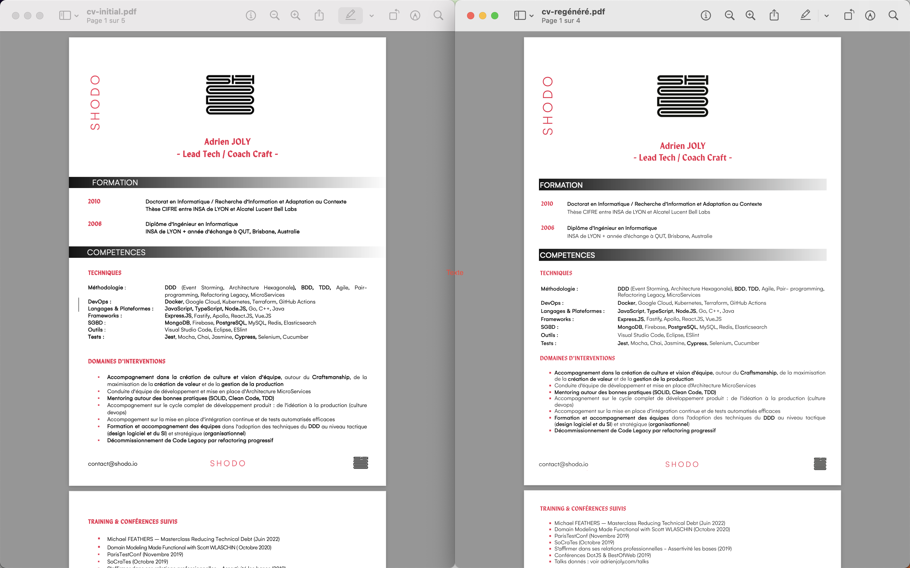

# SHODO CV

My resume:
- maintained as markdown file ([index.md](index.md))
- rendered using Jekyll, by GitHub Pages
- readable online: https://adrienjoly.com/cv/ (without SHODO official fonts, for now)
- printable as a PDF file, with page footers

Feel free to fork!

## Comparison with original CV (made with MS Word)



## How to use locally

After installing Ruby and its bundler:

```sh
$ git clone https://github.com/adrienjoly/cv.git
$ cd cv
$ make build # builds static HTML in _site/
$ make # serve the CV on local HTTP, with auto-regeneration
```
